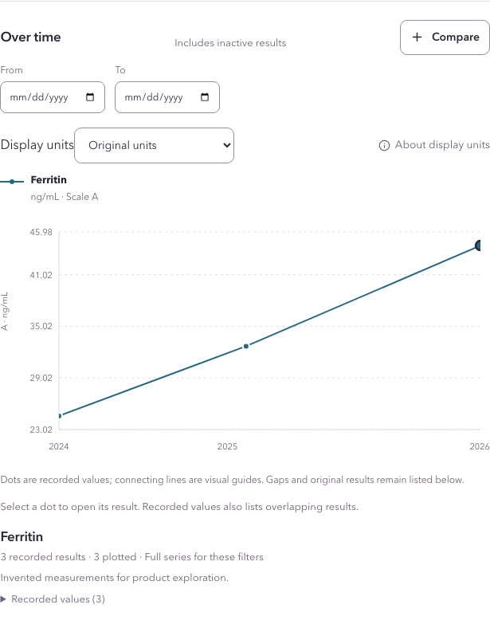
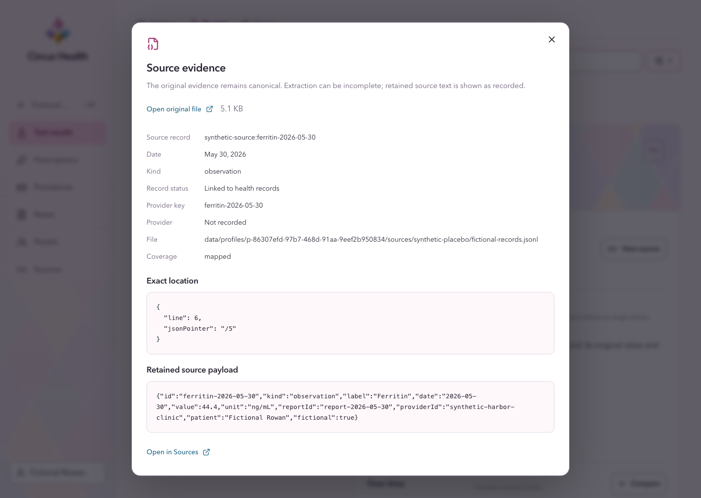

<p align="center">
  
</p>

> 🐒 Your circus, your monkeys, all under one tent.

# 🎪 Circus Health

Circus Health is a private health archive for people who want one durable place for records from different providers. It keeps each original file beside the timeline built from it, so a lab result, medication, procedure, or note can be traced back to its evidence. Profiles help families keep records separate, prepare for visits, review changes over time, and carry forward corrections without erasing history.

The app runs on your computer as a Docker Compose stack. Health data is encrypted in an archive you choose. The working database is a disposable index that the app can rebuild from the encrypted originals and accepted history.

## What it does

- Retains original PDFs, images, HTML, ZIP deliveries, and structured exports.
- Builds reviewable health timelines without silently accepting model output.
- Preserves earlier accepted versions when a record is corrected or restored.
- Keeps private profiles separate, with passkeys for everyday sign-in and a recovery key as a fallback.
- Offers profile-scoped notes, People, source inspection, exports, and Moxie, the optional assistant.
- Supports visit preparation without replacing clinical advice or the source record.

## See it with fictional data

Create a Placebo account to explore the full product without importing health information. Its
generated records are independently fictional and stay in a separate encrypted profile.



Measurements stay grouped over time, with expandable recorded values, their original units, and an
option to compare other measurements.



The evidence view follows that link back to the retained record, exact location, original file, and
stored payload. Both screenshots were generated from a fresh fictional Placebo account.

## Privacy and model processing

Local storage does not mean all inference is local. Circus Health sends the evidence and profile context needed for a model request through the operator's private LiteLLM Proxy to the configured upstream. A hosted provider can therefore receive plaintext from the unlocked profile for that request. A local Ollama route can keep inference on operator-controlled hardware only when its endpoint and cloud settings are configured and verified that way.

The proxy has no health-archive mount and cannot accept changes into the archive. Model proposals remain pending until the user reviews them and the application records the accepted operation. See the [security model](docs/security/model.md) and [model boundary](docs/setup/model-providers.md).

## Install

Circus Health requires Node.js 24.19 or newer, npm, and Docker with Compose v2.30 or newer. The supported runtime is Docker Compose with LiteLLM. Run `nvm use` and `npm ci` from the repository root before launching. Python is confined to the proxy container.

Follow the [installation guide](docs/setup/installation.md) for a new private archive and model connection. The [deployment and operations guide](docs/setup/deployment.md) covers updates, shutdown, backup, recovery, HTTPS, and troubleshooting.

```sh
CRS_DATA_DIR=/absolute/path/to/archive/data CRS_MODEL=health-primary CRS_LITELLM_CONFIG=/absolute/path/to/proxy/config/litellm.yaml CRS_STATE_DIR=/absolute/path/to/proxy/state npm run start
```

The [environment reference](docs/setup/environment.md) documents `CRS_*` settings, loading an external env file, and enabling diagnostics.

The default address is `http://localhost:3001`. Keep the data, LiteLLM configuration, provider credentials, and proxy state outside Git and in separate external locations.

## Release status

Circus Health is prerelease software. Automated checks cover encrypted profile lifecycle, access boundaries, durable record history, imports, and rebuilds with fictional data. Real-provider compatibility, OAuth persistence, representative full-size imports, physical passkeys, target-filesystem behavior, and print review remain acceptance work. A passing connection test does not establish extraction quality or provider privacy.

See the [current work list](docs/todo/readme.md) for open requirements and [documentation index](docs/README.md) for maintained contracts.

## Contributing

Read [CONTRIBUTING.md](CONTRIBUTING.md) before changing the application. The source layout and architectural boundaries are documented in [code organization](docs/architecture/code-organization.md); API behavior lives in [the server API reference](src/server/API.md).

Circus Health is available under the [MIT License](LICENSE). See [third-party notices](THIRD-PARTY-NOTICES.md) for dependency, icon, font, and container attribution.
