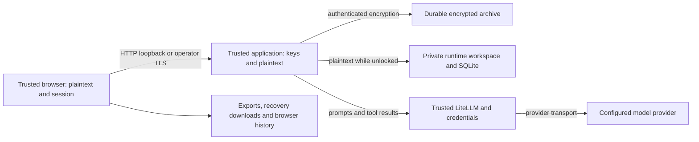

# Security model and implementation review

This reference maps the implemented encrypted runtime, authorization boundaries, model route, evidence, unresolved risks, and proposed mitigations. It is a source review with fictional regression tests, not penetration testing, cryptographic certification, a dependency audit, or a compliance assessment. Source links identify the current owners of each contract; line anchors may drift as those files change.

The encrypted archive protects private contents against a passive archive reader without a recovery secret or usable passkey. It does **not** protect an unlocked profile from the trusted browser, application host, or configured model provider. It authenticates stored contents but does **not** establish that an authentic archive is the newest one.

## Direct answers about unauthenticated access

An unauthenticated client cannot use the reviewed encrypted runtime's private profile routes merely because somebody else unlocked that profile. `requireAccess` requires both a grant in that client's cookie session and an open profile. It runs before dispatch to notes, originals, uploads, exports, assistant conversations, tool-triggering messages, and proposal application. Unknown and locked grants fail with `423 PROFILE_LOCKED`. See [`createVaultApp` / `requireAccess`](../src/server/vault-app.ts) and [private dispatch](../src/server/vault-app.ts).

However, **an unauthenticated client can invoke the configured model's fictional connection test** through `POST /api/ai/test-connection`, which precedes that guard. This does not grant access to a person's assistant conversation or clinical tools. An allowed-origin request from a native client can satisfy the Origin check without browser restrictions. The new [security boundary regression](../src/server/test/security-boundaries-audit.test.ts) proves both private-route rejection and an attempted outbound connection-test request, with the outbound transport intercepted before any real model call.

Unauthenticated clients can also create and verify their own new profile. Successful activation intentionally locks previously open profiles globally. The same regression proves that an independent client with its own freshly generated recovery kit can interrupt another client's unlocked session. This is an **availability risk**, not evidence that it decrypts the other profile. Loopback binding reduces network exposure; it does not authenticate local users or hostile local processes.

## Threat model and trust boundaries

Protected assets include clinical records and original documents; drafts and accepted version history; assistant prompts, tool results and proposals; recovery secrets and profile data keys; passkey wrapping material; provider credentials; and the integrity and availability of the selected current record history.

Consider separately: a stolen offline archive; an archive writer capable of substitution/deletion; a different browser session; a hostile web page; an untrusted local process/service; a malicious imported document or model response; and a compromised browser, host, proxy or provider. The last group crosses trusted execution boundaries and can see plaintext while processing it. A filesystem administrator who can replace the application or read its memory is not restricted to the archive-reader threat model.



The following assumptions are acceptance conditions, not guarantees supplied by this code:

| ID  | Testable operating assumption                                                       | How to check / consequence if false                                                                                                                                                                                                                                                |
| --- | ----------------------------------------------------------------------------------- | ---------------------------------------------------------------------------------------------------------------------------------------------------------------------------------------------------------------------------------------------------------------------------------- |
| A1  | The encrypted `startRuntime` is the deployed entry point.                           | Inspect container command and startup response. `startLegacyRuntime` and standalone `createApp` lack the outer vault session authorization.                                                                                                                                        |
| A2  | The host, application files, browser extensions and same-host services are trusted. | Review OS accounts, local services, extension policy and executable ownership. Host compromise can read keys/plaintext; localhost is not a multiuser access boundary.                                                                                                              |
| A3  | Network exposure matches the operator's intended audience.                          | Inspect effective Compose port bindings/firewall/proxy configuration. Default is loopback; remote exposure needs separate access control and transport review.                                                                                                                     |
| A4  | Runtime and temporary storage are private and ephemeral within the trusted host.    | Inspect effective tmpfs mounts, UID/modes, swap, core-dump and host backup policy. Linux startup requires runtime tmpfs; Docker daemon/host administrators can still use `docker exec` to read unlocked plaintext. Native non-Linux contributor checks provide no tmpfs guarantee. |
| A5  | Recovery kits and old backups are independently protected.                          | Perform a fictional restore drill and inspect backup access/retention. Archive deletion or passkey removal does not erase copied secrets or old wrappers.                                                                                                                          |
| A6  | Proxy/provider processing and retention are acceptable for the data sent.           | Inspect effective selected model, upstream credentials, operator logging and provider policy. Repository configuration cannot attest provider behavior.                                                                                                                            |
| A7  | Storage honors atomic rename/fsync and one writer; authenticity is not freshness.   | Run storage/fault tests on the actual filesystem and retain an independent trusted backup/version record if rollback detection is required.                                                                                                                                        |
| A8  | Users explicitly finish/lock sessions and protect downloaded material.              | Test session lifecycle on target browsers and review export destinations. No idle session expiry or secure erasure of browser state is established here.                                                                                                                           |

## Route and authorization inventory

`startRuntime` checks Host before dispatch. `/api/runtime` and `/health/ready` are handled **before** vault Origin and cookie checks, returning `200` when ready and `503` otherwise, with `Cache-Control: no-store`. In the ready encrypted runtime they reveal readiness/outcome/phase, build ID, encrypted mode, startup duration and **profile count**. They do not include clinical contents or private filenames. A supplied foreign Origin does not change this handler; no permissive CORS response is added. Build IDs are deployment identifiers, not signatures or attestations. See [`startRuntime`](../src/server/runtime.ts).

For other API routes, `createVaultApp` validates Host, rejects a supplied unrecognized Origin even on reads, and requires an exact allowed Origin for methods other than GET/HEAD. An absent Origin is permitted for reads. Accepted origins are loopback origins and explicitly configured origins, with development origins only when enabled. These checks constrain browsers and DNS rebinding; native clients can set headers. No wildcard CORS permission or CSRF token is provided. See [request normalization and guards](../src/server/vault-app.ts).

| Surface                                                                                                                                                       | Authorization and disclosure / effect                                                                                                                                                                                      |
| ------------------------------------------------------------------------------------------------------------------------------------------------------------- | -------------------------------------------------------------------------------------------------------------------------------------------------------------------------------------------------------------------------- |
| GET `/api/profiles`                                                                                                                                           | Public profile cards: profile identifiers, display names/icons and state/size metadata, session-relative lock state, and whether a passkey exists for the current hostname. Names/icons can themselves identify a patient. |
| GET `/api/storage/archive`                                                                                                                                    | Public aggregate archive/runtime storage accounting. No private original filenames or records.                                                                                                                             |
| GET `/api/ai/status`                                                                                                                                          | Public configured model/endpoint/auth-mode status, without the credential itself. A deployment endpoint can reveal infrastructure metadata.                                                                                |
| POST `/api/ai/test-connection`                                                                                                                                | Public allowed-origin fictional model/tool/image test; provider use and availability/cost exposure remain possible.                                                                                                        |
| POST `/api/profile-setups`, `/api/profile-setups/resume`, `/api/profile-setups/:token/verify`                                                                 | Public creation or recovery-proof flows. Copying from a profile requires its grant. Verification requires acknowledgment and the recovery secret. A new activation can lock another client's profile.                      |
| POST `/api/profiles/:id/unlock`                                                                                                                               | Public recovery proof, then session grant and globally serialized activation.                                                                                                                                              |
| POST `/api/profiles/:id/passkeys/authentication-options`, `/authenticate`, `/cancel`                                                                          | Public assertion challenge/proof/cancellation flows, session-bound challenges. Credential IDs, transports and PRF salts needed for authentication are public metadata; proof is still required.                            |
| Profile passkey list/rename/remove, enrollment options/verify/confirm                                                                                         | Session grant plus open profile. Labels are decrypted only here. Checks after asynchronous verification prevent canceled/locked challenges being committed.                                                                |
| Profile storage estimate/totals, lock and delete                                                                                                              | Session grant plus open profile. Delete also checks current typed name/version.                                                                                                                                            |
| Profile overview, providers, tests/types/trends, medications, procedures, documents, evidence, visibility, record history, sources/source records and content | Private delegated `createApp` read routes; outer session guard applies to all of them. Database selection comes from the guarded profile path.                                                                             |
| Profile notes/history/historical options, person filters/tags/types, link targets/related notes, assets/content and attachments                               | Same private guard, including direct original-file URLs. URL or asset identifier alone grants no access.                                                                                                                   |
| Profile note create/save/restore/convert/finish/correction, medication current-status, visibility, attachments and storage flush                              | Same guard for mutations. Individual handlers add validation, version/conflict and operation semantics. Navigation warnings are browser UX, not extra server authorization.                                                |
| Profile assistant status/test-connection/chats; chat read/messages/retry/cancel/proposal apply                                                                | All private here, unlike the global connection test. Sending messages or conversion requests can start model processing.                                                                                                   |
| Profile intake limits/list/detail/plan/navigation/unit/review/read and upload/inspect/questions/answers/plan/batch/convert/proposals/import                   | All private before intake dispatch. Conversion can start model processing; staging/intake edits are writes even before clinical import.                                                                                    |
| Profile note-export options/preview/validate/PDF/evidence                                                                                                     | All private. Export snapshot tokens are profile-bound and expire; they do not replace the session guard.                                                                                                                   |
| Legacy profile lifecycle copy/backup/backups                                                                                                                  | Explicitly rejected by the vault wrapper; not a public escape hatch to legacy handlers.                                                                                                                                    |
| Static frontend files                                                                                                                                         | Public, contained within the built distribution. No profile data belongs in these artifacts.                                                                                                                               |

The full dispatch branches are [`vault-app.ts`](../src/server/vault-app.ts), [`index.ts`](../src/server/index.ts), and [`intake-routes.ts`](../src/server/intake-routes.ts). This inventory groups dynamic IDs and sub-actions; new branches must be reviewed at the wrapper boundary, not assumed private because their names contain a profile ID.

The intake routes use that same private boundary for reviewed metadata, review drafts, package inventory/member reads/role plans, and Vision queries. Drafts and deferred-review annotations are encrypted profile metadata; originals are unchanged. Explicit uncertainty can clear a date but cannot silently correct another value. ZIP paths, entry/file counts, expanded sizes, and literal structure windows remain bounded; role labels never authorize execution or establish clinical completeness. Automatic model preflight rechecks the owning profile around asynchronous work. The existing anonymous manual-probe risk below remains open. See [the exact contracts](../src/server/INTAKE.md); this section is bounded review, not a new exhaustive security audit.

## Encryption, keys and on-disk formats

Each profile receives an independent random 32-byte data key and random 32-byte recovery secret. The recovery phrase is BIP39 encoding of random entropy, **not a user-selected password** and not a wallet seed stretched by a password KDF. Possession of the kit is sufficient to recover the profile; there is no second operator-held recovery factor. See [`begin`, `secretKey`, `verify`](../src/server/encrypted-profiles.ts) and [`vault-crypto.ts`](../src/server/vault-crypto.ts).

| Material / format                                              | Construction and binding                                                                                                                                                                                                                                                                                                                              |
| -------------------------------------------------------------- | ----------------------------------------------------------------------------------------------------------------------------------------------------------------------------------------------------------------------------------------------------------------------------------------------------------------------------------------------------- |
| `circus-health-keyring-v1`                                     | Plaintext unlock header containing profile ID, recovery wrapper, passkey public verification/PRF metadata and active state. It does not contain an unwrapped data key or authenticator private key.                                                                                                                                                   |
| Recovery/passkey data-key wrappers                             | HKDF-SHA256 derives a 32-byte wrapping key from a 32-byte recovery secret or PRF result, with profile ID as salt and method-specific context. XChaCha20-Poly1305-IETF uses a fresh random 24-byte nonce. AAD includes vault version, profile and method; passkey method includes credential ID. Wrapper decrypt requires the expected 32-byte result. |
| `circus-health-recovery-v1`                                    | Downloadable plaintext recovery kit carrying profile identity and encoded secret. Its confidentiality is the user's responsibility outside the archive.                                                                                                                                                                                               |
| Encrypted vault objects                                        | Libsodium secretstream XChaCha20-Poly1305, `CIRCUS01` framing, secretstream-generated header/state, bounded 1 MiB frames and an explicit final tag. AAD binds profile and purpose/object identity. Missing final tag, trailing bytes, wrong owner/purpose and altered ciphertext fail.                                                                |
| `circus-health-vault-head-v1` / `circus-health-vault-index-v1` | Encrypted mutable manifest/head selects an encrypted index and record head; immutable encrypted objects store originals and versions. Random object IDs hide filenames; encrypted index stores paths/hashes.                                                                                                                                          |
| SQLite cache and metadata                                      | Separately encrypted with cache-specific purposes. Cache is disposable and can be rebuilt from accepted durable records; it is not an independent freshness witness.                                                                                                                                                                                  |
| Optional passkey label                                         | XChaCha20-Poly1305-IETF under the profile data key, fresh 24-byte nonce, AAD `['circus-health-passkey-label-v1', profileId, credentialId]`. Plaintext names are not public keyring fields.                                                                                                                                                            |

Implementation: [`context`, `wrap`, `unwrap`, `encryptObject`, `decryptObject`](../src/server/vault-crypto.ts), [`openVault`, `publish`, `recordStorage`](../src/server/vault-store.ts), and [`encryptLabel` / `decryptLabel`](../src/server/profile-passkeys.ts). Nonce generation relies on operating-system randomness and libsodium; no custom cryptographic primitive is implemented. This review tests misuse resistance at application boundaries, not the cryptographic libraries' internals.

Public registry/card data, keyring public metadata, profile/object counts, ciphertext lengths, filesystem timestamps and activity patterns remain observable. Per-profile byte-verified deduplication is not cross-profile deduplication. Symlink/path checks and restrictive creation modes limit accidental traversal; they are not a sandbox against a host administrator racing or replacing files.

### Passkey claims and limitations

Registration requires a hostname, discoverable credential and user verification. The server verifies exact challenge, origin, relying-party ID and user verification using SimpleWebAuthn. Registration alone does not persist an unlock key: a subsequent assertion must return PRF output, wrap the existing data key, and successfully unwrap the new wrapper before persistence. A signature is not treated as an encryption secret. See [registration and confirmation](../src/server/profile-passkeys.ts).

Challenges are session/profile/kind/generation bound, limited to 1,000 live entries and five minutes. Lock invalidates generations and pending challenges. Authentication re-reads the keyring after verification and checks credential presence and unchanged counter before writing the new counter; removal and rename likewise read current metadata rather than resurrecting stale snapshots. See [challenge handling](../src/server/profile-passkeys.ts) and [authentication](../src/server/profile-passkeys.ts).

The server necessarily receives the PRF result from the browser over the application transport. A compromised unlocked browser can capture it or the recovery kit. PRF support and authenticator behavior vary; see the [WebAuthn PRF specification](https://www.w3.org/TR/webauthn-3/#prf-extension). Mocked verification and virtual-authenticator tests do not establish physical Firefox/1Password/hardware-key interoperability or device extraction resistance. Removing a passkey affects the current keyring; an old archive plus that credential's old wrapper can still recover the unchanged data key. No data-key rotation or remote backup revocation is established.

## Sessions, locking and in-flight work

The session cookie is a random 32-byte bearer token with `Path=/; HttpOnly; SameSite=Strict`. Sessions live in an in-memory Map. They have no explicit TTL, idle expiry, capacity bound, authentication-time rotation or `Secure` attribute. Restart loses grants; explicit lock revokes the profile in every session. Multiple sessions can prove access to the same globally open profile. See [`session`, `revokeAndLock`, `activate`](../src/server/vault-app.ts).

HttpOnly prevents script reads of the cookie; it does not prevent same-origin script requests. Cookies are shared across ports on a host, unlike origin access: a hostile service on the same hostname can receive the cookie when visited. SameSite does not make a different localhost port a separate cookie security boundary. This is part of the trusted-local-services assumption, and custom HTTPS deployments also need to address the missing Secure flag. See [RFC 6265, sections 4.1.2 and 8.5](https://www.rfc-editor.org/rfc/rfc6265).

Activation is serialized and proves/materializes the new profile before closing old profiles. A failed proof does not intentionally lock the existing profile. Successful activation revokes old grants, cancels challenges, destroys tracked private responses, closes the old assistant/database and clears the key/workspace. Private successful response headers recheck authorization and flush durability before publication. Profile keyring routes add post-await checks where required. See [`activate` and private response wrapper](../src/server/vault-app.ts), [`lock`](../src/server/encrypted-profiles.ts), and the isolation/activation tests below.

These mechanisms cannot retract response bytes already received, data already sent to a provider, a browser screenshot, or a completed mutation. A lock racing with a write may produce an unconfirmed result in the caller even if a durable operation completed; callers must reconcile operation/version state, not silently replay all writes. Closing a connection is not a transaction rollback.

Browser requests capture profile identity, abort on identity changes, and reject stale responses; profile remounting clears component state. This limits cross-profile stale rendering but does not promise immediate erasure of pixels in an inactive tab. Drafts and pending save state remain caller-owned in memory, with navigation/unload warnings and explicit retry/conflict handling. See [`api.ts`](../src/app/data/api.ts), [`useResource`](../src/app/data/api.ts), and [draft writer](../src/app/features/notes/draft-writer.ts). The reviewed shared read recovery preserves these boundaries without a persistent mutation queue; its limits are detailed below.

### Connection, recovered reads and guarded refresh

The reviewed frontend delta does not add a private heartbeat or model test. [`connection.ts`](../src/app/data/connection.ts) independently probes the existing public `/api/runtime` with `cache: no-store`, a five-second timeout and bounded backoff. Connected means a successful runtime response, not model/internet availability, an unlocked profile, or trustworthy software. `503` is a responding-but-unavailable server; the monitor can retain a previously observed build ID during an outage. The public metadata described in the route inventory remains public; the monitor adds no profile-content request to that probe.

[`readWithRecovery`](../src/app/data/read-recovery.ts) coalesces body-free GETs by URL, request options and mutation generation. It permits one retry after an independent successful probe for transport/body failures and HTTP 502/503/504. **423 is not an offline retry condition**: `api` handles a matching `PROFILE_LOCKED` response by clearing the selected locked profile through the registry. Mutation start and completion advance the generation so subsequent reads cannot join an earlier generation's request. This does not retroactively invalidate every already-running read or establish linearizable reads during concurrent writes.

Waiters are bounded to 64 shared requests and 20 seconds. Each subscriber can cancel independently; the underlying request aborts when its final subscriber leaves. Scoped API calls subscribe to profile identity changes, and `useResource` retains data only for an unchanged profile/resource key. A changed key immediately hides prior data; authoritative registry lock state clears the selection and remounts the keyed profile interface. Reconnection refreshes profile metadata without automatically selecting somebody else's open profile. Source: [`api`](../src/app/data/api.ts), [`ProfileSession`](../src/app/components/ProfileProvider.tsx), and [`replaceProfiles`](../src/app/data/profile.ts).

There is **no durable health-data queue and no automatic mutation replay**. There are nevertheless plaintext in-memory component snapshots and full response buffers: the helper calls `response.arrayBuffer()` before constructing shared response clones. The request-count/time bounds are **not a response-byte or total-memory bound**. A large permitted response or many large concurrent responses can cause browser memory pressure; no memory stress test was performed for this review. Data already displayed may remain available during a network outage until a lock is learned, the profile changes, or the tab closes. Offline retention is not continued server authorization.

The build notice compares known client/server IDs and keeps dismissal in tab memory for that pair; it never automatically refreshes. Refresh is disabled for shared API mutations and uses the registered editor transition guard. An errored/unconfirmed note save remains unsaved work even if its visible text was reverted. A clean editor can adopt a newer fetched version; dirty or uncertain editors retain their state and revision. Save explicitly reconciles the retained operation; Discard abandons local work and cannot reverse an accepted server version. These are caller-owned safeguards, not a general transaction/draft store. See [`ConnectionNotices`](../src/app/components/ConnectionStatus.tsx), [`NoteEditor`](../src/app/features/notes/NoteEditor.tsx), and [connection behavior](connection-awareness.md).

Direct profile lifecycle requests, direct export fetches, XMLHttpRequest attachment uploads and other specialized paths do not acquire the shared API write counter or GET-retry semantics merely because the monitor exists. They retain their own cancellation, modal and busy guards. PDF/original streaming is likewise not buffered/retried by this helper. New direct request paths must register appropriate transition protection themselves; the shared pending-write count is not an exhaustive application-wide mutation lock. See [`profile-management.ts`](../src/app/data/profile-management.ts), [`NoteExportDialog`](../src/app/features/notes/NoteExportDialog.tsx), and [`AttachmentPanel`](../src/app/features/notes/AttachmentPanel.tsx).

Application-scoped connection toasts contain generic connection/save guidance and deliberately survive profile changes. Ordinary success toasts remain profile-filtered and are cleared on identity changes. Do not pass clinical content into the application-scoped notification helper. The generic [`CreatableCombobox`](../src/app/components/CreatableCombobox.tsx) and [`SelectionChip`](../src/app/components/SelectionChip.tsx) render labels as React text, keep partial queries in component memory, and invoke parent callbacks only for selection/removal. They add no network request, persistent suggestion store or HTML execution surface. Option scope and accepted-value validation remain responsibilities of the caller/server; UI normalization or `maxLength` is not authorization or server input validation.

## Plaintext, browser and parser exposure

While open, the selected profile's original files, journals and SQLite database are materialized in its private runtime directory. Keys and parsed contents are also in application memory. Lock attempts encrypted synchronization, closes services, clears key buffers and removes the workspace even on failure. This is lifecycle cleanup, not proven secure erasure: JavaScript strings, native-library copies, swap, core dumps and host snapshots may retain material. See [`open` and `lock`](../src/server/encrypted-profiles.ts).

Default Compose uses a non-root application, read-only container filesystems, bounded runtime/tmp tmpfs mounts with `noexec,nosuid,nodev`, dropped capabilities, `no-new-privileges` and a zero core-dump limit on both services. The Linux runtime checks the filesystem type before acquiring the writer lease or starting the application and refuses a missing/non-tmpfs runtime directory. This validates the runtime mount, not `/tmp`, host swap policy, available capacity or nested mounts. Native non-Linux contributor checks skip the Linux filesystem magic check; their ordinary paths can retain plaintext after a crash. See [runtime containment and verification limits](docker-runtime.md#runtime-capacity-and-containment).

Tmpfs and archive encryption do not prevent a Docker daemon or host administrator from inspecting an unlocked workspace. Someone able to run `docker exec` in the health container can read its plaintext runtime files; trusted-host control may also expose process memory and keys. The capability drop and `no-new-privileges` constrain the workload, not an administrator controlling Docker. Restrict Docker access and the host account accordingly. Tmpfs can still be swapped or captured in host snapshots; disabling container core dumps does not establish secure erasure or constrain every host-level capture mechanism.

Downloaded exports, printed documents, copied text and recovery kits leave this storage contract. Browser local storage contains profile/theme choices; URL search/hash state can expose search terms and record IDs through history, synchronization and screenshots.

Originals are private authenticated streams with a MIME allowlist, `nosniff`, `no-store`, and restrictive sandbox CSP; unsupported types are attachments. Attachment upload validation includes magic/type and size checks. Intake uploads are bounded (default 128 MiB; extracted content default 64 MiB, configurable within limits), but untrusted PDF/archive parsing still runs trusted parser code. Size bounds are not proof against parser vulnerabilities or all CPU/resource exhaustion. See [`serveOriginal`](../src/server/index.ts), [`assets.ts`](../src/server/assets.ts), [`intake-upload.ts`](../src/server/intake-upload.ts), and [`intake-files.ts`](../src/server/intake-files.ts).

Markdown renderers avoid executing raw HTML and constrain links; remote images are rendered as references rather than automatically fetched. PDF export escapes content, uses restrictive HTML CSP and aborts renderer network requests. Snapshot tokens are profile-bound with expiry and fingerprint revalidation. Chromium still processes plaintext in memory/temp files until cleanup, including work that may finish after a client disconnect. See [note exports](../src/server/note-exports.ts), [NoteText](../src/app/features/notes/NoteText.tsx) and [AssistantText](../src/app/features/assistant/AssistantText.tsx).

The main static application response has `nosniff` and cache controls, but no application-wide CSP, frame-ancestors or HSTS is set in [`staticFile`](../src/server/runtime.ts). The source-document CSP does not protect the main application against injected script or framing. TLS and any additional proxy headers are operator responsibilities; merely setting a public origin does not provide TLS.

## Assistant, LiteLLM and provider boundary

Private assistant dispatch chooses the database from the authorized path, not a model-supplied profile. `callTool` checks that its run is active, obtains `dbFor(profileId)`, and passes that database to scoped readers. Record-history arguments are explicitly overridden with the trusted profile ID. Mapping extensions receive the same database and clinical application checks its owner. Tool schemas and query allowlists constrain arguments; no arbitrary shell, SQL, path or general network tool is exposed by these registered handlers. See [`callTool`](../src/server/assistant.ts), [`mappingAssistantExtensions`](../src/server/mapping-actions.ts), and [`owner`](../src/server/mapping-actions.ts).

This is a code-supported scope restriction, not a proof against every future tool or parser bug. A model can read the authorized profile through available tools beyond the current screen. Conversation messages, page context, identity and tool results can be sent to the configured proxy/provider. Prompt injection in imported records may influence those reads or propose misleading changes within that scope. There is no semantic guarantee that model output is accurate or private merely because it passed a JSON schema.

Tools can write conversation/intake staging and proposals. Accepted clinical changes require the separate authenticated `apply` path, with proposal/version checks and operation receipts; mapping/correction tools create previews and pending proposals. The model is not given the HTTP apply endpoint as a tool. The browser's human review remains meaningful but is not an extra server identity factor: a client with a valid grant can call apply directly. See [`apply`](../src/server/assistant.ts).

Named People extracted from uploads follow the same authorization boundary and require a separate explicit add/update. The host validates literal name/field support in retained passages, original/member scope and current target versions; it blocks known Self matches and never transfers relatives' history into Self clinical records. These checks establish evidence alignment and mutation scope, not the truth of the transcription or the identity of a person with the same name. Source retention and the personal-entry transaction have separate durable receipts, so source publication alone cannot imply a saved Person. See [People import implementation](../src/server/intake-people.ts), [validation](../src/server/intake-people-format.ts) and [focused tests](../src/server/test/intake-people.test.ts).

The assistant allows one active run per profile, has a 15-minute run deadline and active-state checks around asynchronous progress. Closing a profile cancels the bridge and prevents subsequent scoped database use. HTTP chat updates are polled; model progress is internal state rather than an unauthenticated SSE route. Original-file response streams are separately tracked by the vault wrapper. Cancellation cannot undo provider disclosure already made.

The bridge sends bearer-authenticated requests to an explicitly configured origin, rejects redirects, bounds responses/tool rounds, disables model/provider fallback requests and validates tool arguments before dispatch. Native PDF support is a host-selected capability, not a model tool argument. It sends a derived PDF containing only the requested original page; original bytes remain unchanged. The isolated worker invokes qpdf on its verified file descriptor with bounded output and runtime. The two bounded qpdf passes recursively project allowed rendering dictionaries, stripping catalog and nested metadata/private/associated-file/action branches and unreachable objects. Unprovable nonempty rendering-resource maps, Type3 glyph programs and shared JBIG2 globals take the raster path because qpdf does not remove all unused shared resources. Valid opaque rendering streams remain exact; this is not semantic redaction of bytes inside fonts, images or content streams. Intermediate JSON uses an immediately unlinked mode-0600 descriptor on verified Linux tmpfs, never a named plaintext file. Catalog metadata/attachments are not copied; annotations and interactive forms take the image path to avoid including cross-page references or omitting visible annotation content. An explicit PDF-format rejection may retry the same page as PNG on the same route, with no replay of completed tools or writes. Other transport failures do not trigger format substitution. `localOnly` applies network-address/model restrictions, including address resolution/pinning, but cannot attest what a trusted proxy does upstream. It is not a universal deployment default or an egress firewall. See [`proxy-model-bridge.ts`](../src/server/proxy-model-bridge.ts) and [`model-config.ts`](../src/server/model-config.ts).

The [LiteLLM configuration filter](../deploy/litellm/configure.py) selects one exact model entry and rejects operator callbacks, caching/logging and fallback configuration; an opt-in project-owned empty-response diagnostic callback emits only allowlisted event counts/status/reason and stores the latest metadata summary in proxy tmpfs, without payload content by default; a separate explicit response-body capture flag for authorized debugging writes bounded provider output to owner-only proxy tmpfs and must be disabled after the test; [Compose](../compose.yaml) disables container log drivers and keeps LiteLLM unpublished on an internal application/proxy network. LiteLLM also has a provider network, and the app has its browser network: these declarations do not prove that the application has no outbound internet connectivity. The proxy operator, upstream provider, mounted credentials/configuration and browser OAuth storage are trusted and outside profile encryption. No real provider request or retention inspection was performed in this review.

Default-on import performance summaries retain bounded metadata in a separately encrypted profile sidecar, outside the medical evidence manifest. The unlocked-profile session authorizes browser ingestion and export; strict schemas exclude clinical values, filenames and arbitrary strings. Plaintext is cleared at lock, and diagnostic persistence is best-effort with explicit loss counters. Existing backups may retain older ciphertext beyond the live summary's seven-day inactivity pruning window. The [performance diagnostics contract](import-performance.md) documents detailed-trace opt-ins, limits and source-ID salting.

Credentials are read outside the data archive and public status omits their values. Generic transport/internal errors reduce accidental exposure; they are not complete secret redaction. Assistant journals intentionally retain conversation/tool content, potentially including secrets pasted by a user or echoed by a model. Reverse-proxy access logs, provider logs, host diagnostics and exports require separate retention review. Pinned dependencies/images and non-root execution reduce some risks but do not establish supply-chain or vulnerability assurance.

## Durability, tampering, rollback and backups

Durable writes use exclusive temporary files, restrictive modes, file fsync, atomic rename and parent-directory fsync. Vault publication writes immutable objects/index before publishing the encrypted head. Record versions validate hashes, profile ownership, ancestry, sequence and previous-version references; accepted history can rebuild disposable SQLite. A writer lease limits concurrent writers. See [`atomicOutput`](../src/server/vault-crypto.ts), [`publish`](../src/server/vault-store.ts), [`record-versions.ts`](../src/server/record-versions.ts), and [`storage-lock.ts`](../src/server/storage-lock.ts).

These controls detect changed ciphertext and inconsistent selected chains. They do not stop deletion, denial of service, replay of a complete older authentic head, or a host holding the data key from producing new valid ciphertext. The audit regression restores a saved older `manifest.enc`, removes disposable cache and unlocks successfully to the older accepted note. Newer immutable objects can remain physically present but unreachable from that chosen head. **Append-only record history is an application/storage convention with validated ancestry, not externally witnessed append-only storage.**

Crash tests establish selected publication/rebuild behavior under injected failures, not power-loss behavior for every filesystem, storage controller, network mount or host. Backups must preserve the encrypted archive and keyring consistently and retain a usable recovery kit separately. Restoring an old backup can restore removed passkeys, old public cards and earlier clinical state. Profile deletion does not erase independent backups; forensic erasure and key rotation are not implemented assurances. Refer also to [vault format](vault-format.md), [record version storage](record-version-storage.md), and [profile encryption](profile-encryption.md).

## Residual risk register

Likelihood is conditional on the stated attacker and deployment, not a measured incident probability. “High” impact may concern confidentiality, integrity or availability; controls listed above remain in place. The proposed mitigations below are **not implemented by this documentation change**.

### Effort estimates

Effort is separate from likelihood, impact and priority. These are rough engineering estimates for one contributor familiar with this codebase: **XS** up to half a day; **S** about 1–3 working days; **M** about 4–10 days; **L** about 11–20 days; **XL** more than 20 days or a design that needs decomposition before reliable estimation. Bands include implementation, focused regression tests, documentation and a fictional deployment check where applicable. They exclude waiting for accounts/devices, external security review and provider responses; they are not delivery promises. Operational checks can be small even where eliminating the underlying risk is impossible within the application.

Each risk has a bounded first step and, where different, a larger systemic option. Estimates assume the current single-instance architecture and preserve accepted clinical history, recovery compatibility and caller-owned unconfirmed saves. Shared work overlaps across risks: do not sum the rows into a schedule. Re-estimate after deciding the intended deployment audience and authentication boundary.

| ID  | Risk / likelihood context                                                                              | Impact and residual assessment                                                                                | Evidence, verification and remaining work                                                                                                                                                | Estimated mitigation effort                                                                                                                                                                                                             |
| --- | ------------------------------------------------------------------------------------------------------ | ------------------------------------------------------------------------------------------------------------- | ---------------------------------------------------------------------------------------------------------------------------------------------------------------------------------------- | --------------------------------------------------------------------------------------------------------------------------------------------------------------------------------------------------------------------------------------- |
| R1  | Anonymous connection tests; easy for a reachable native client, less reachable on loopback.            | Provider cost/availability; **medium**, potentially high with unrestricted exposure.                          | Public route before grant guard; new intercepted-transport test. Consider authenticated/operator-only probes and bounded rate/concurrency. Actual provider billing untested.             | **S**: gate global probes and add bounded concurrency/rate tests. **M** if introducing a new operator-authentication flow instead of reusing an agreed grant.                                                                           |
| R2  | Anonymous profile creation/activation and uncapped sessions; easy if reachable.                        | Disk/memory growth and forced profile locking; **medium locally, high availability risk if exposed**.         | New two-client activation proof; sessions Map and setup routes. Consider bootstrap/access policy, quotas and rate limits. No load test performed.                                        | **S**: session/setup caps and bounded admission. **M**: bootstrap/enrollment policy plus activation permission and regression journeys; **L** for broader multiuser tenancy.                                                            |
| R3  | Authentic archive rollback by an archive writer or accidental old restore.                             | Silent older clinical view, restored old key metadata; **high integrity risk for that threat model**.         | New successful rollback regression. Requires an independent trusted freshness/version anchor or operational detection, not another checksum in the same archive.                         | **S**: trusted restore/version verification procedure. **XL**: independent freshness witness with crash-safe publication, outage policy and backup recovery; decompose before commitment.                                               |
| R4  | Host/browser/same-host service compromise, stolen session; conditional on local trust failure.         | Open-profile disclosure or mutation; **high**.                                                                | Bearer cookie/no expiry/host-port scope; host can read keys. Harden local environment, review session expiry/rotation and cookie transport. Physical hostile-service test not performed. | **S**: session expiry/rotation and deployment-aware cookie tests after policy choice. **L**: stronger local service/user isolation. No application change cures a compromised host/browser.                                             |
| R5  | Custom remote deployment without adequate TLS/access control; configuration dependent.                 | Session/PRF/recovery disclosure, broad public attack surface; **high**.                                       | Missing Secure and app TLS; Host/Origin are not client authentication. Review reverse proxy, cookie policy and external access before exposure. No production proxy test.                | **S**: verify loopback-only containment. **M**: one documented HTTPS/access-controlled proxy topology, cookie/origin handling and browser tests; other topologies need re-estimation.                                                   |
| R6  | Runtime/swap/dumps/backups/provider retain plaintext; operating-policy dependent.                      | Health-data disclosure; **high**.                                                                             | Materialized workspace, browser outputs, model transport. Verify A4–A6 on actual host/provider. No forensic-erasure or provider-retention evidence.                                      | **S**: mount/permission/logging/secret-retention checks and fictional cleanup drill. **L**: controlled egress and host hardening across a supported deployment. Provider retention and secure erasure cannot be guaranteed by app code. |
| R7  | Prompt injection or incorrect proposals within an authorized profile; plausible with untrusted inputs. | Excessive provider disclosure or wrong user-approved changes; **medium/high** depending review.               | Scoped tools and explicit apply reduce scope, not semantic error. Add targeted adversarial workflow evaluations if required; no broad model evaluation performed.                        | **M**: focused adversarial tool/proposal evaluations and targeted disclosure controls. **L**: broader capability/consent redesign with evaluation. No finite size promises elimination of semantic error.                               |
| R8  | Malicious document exploits parser/browser, resource exhaustion, or future UI injection.               | Host/browser compromise or denial of service; **potentially high, likelihood unmeasured**.                    | Bounded upload/extraction, sandboxed source display and PDF network denial; main app lacks CSP/framing policy. No fuzzing or dependency vulnerability review.                            | **S**: compatible CSP/framing policy and focused regressions. **M**: parser process/resource isolation; **L**: sustained fuzzing corpus and hardening, without claiming parser safety.                                                  |
| R9  | Lost kit/all authenticators, or belief that passkey removal revokes old backups.                       | Unrecoverable data or unauthorized recovery from old copies; **high consequence**.                            | Unchanged data key and copied old wrappers. Test restore and retention; consider key rotation if backup revocation is a requirement.                                                     | **XS**: clarify backup/passkey-revocation limits. **S**: fictional recovery/retention drill. **XL**: data-key rotation, interrupted-migration recovery and backup compatibility design.                                                 |
| R10 | In-flight result arrives before lock or write succeeds without acknowledgment.                         | Already-delivered disclosure or uncertain save outcome; **medium residual**.                                  | Response destruction, active-run checks and operation/version semantics; tested selected races. Do not promise retrospective revocation or automatically replay unconfirmed mutations.   | **S**: enumerate direct request guards and add targeted lost-response/lock tests. **M**: close identified operation-receipt/transition gaps. Already-delivered bytes cannot be revoked.                                                 |
| R11 | Large recovered GET responses; depends on profile size and simultaneous reads.                         | Browser memory pressure and possible loss of unsaved tab state; **medium availability risk, size-dependent**. | `readWithRecovery` buffers complete bodies; 64-request/20-second bounds do not cap bytes. No memory stress test. Consider per-response/aggregate limits if large datasets require them.  | **S**: streamed byte accounting and per-read/aggregate budgets with cancellation tests. **M** if large endpoints also need pagination or specialized transfer paths.                                                                    |

## Recommended next steps

Prioritization and task status live in [CRS-084](application-todo.md#crs-084). The risk IDs and priority labels below describe this assessment; they are not a separate task backlog.

These are proposed controls, not completed mitigations or authorization to change a live deployment. The highest-value first package is **contain the test deployment and credentials, gate costly/public state-changing operations, and cap recovered-read memory**. It addresses reachable demonstrated behavior with bounded work; archive freshness and key rotation require separate design because they change recovery guarantees. Priorities below express sequence, not new severity scores. If remote access is planned, complete P0 before exposing it; if hostile archive writers are in scope, elevate the R3 design before relying on clinical freshness.

### P0 — Establish the deployment and credential boundary before real-provider use

**R4/R5/R6; S for containment, M for one remote topology.** Keep the default loopback binding and verify effective ports, mounts and process ownership. For an authorized separate user/test instance, propose separate data/runtime directories, Compose project and container identities, and separate proxy secret/OAuth-state directories. Use fictional profiles until the operator explicitly chooses otherwise. A different port alone does not isolate host cookies; separate browser profiles or appropriately isolated hostnames/origins and host accounts are part of the boundary design. Do not mount a personal archive, another instance's tokens, or broad home directories into the test stack.

Treat an upstream OAuth refresh/access token as a credential even when no provider API key is used. Keep it out of Git, health archives, build artifacts and ordinary logs; restrict the persistent authentication directory to the intended operator/proxy. The application's LiteLLM master credential and the proxy's upstream OAuth credential serve different boundaries. Using OAuth instead of an API key is **not itself a vulnerability**. Codex-default or local-model setup does not establish token isolation, provider retention or private-only egress; those must be verified against effective configuration. Follow [model-provider guidance](model-providers.md), while keeping these proposed controls distinct from its recorded implementation and real-provider evidence.

**What this buys:** limits accidental cross-instance data/token access and network exposure before paid/provider operations begin. **Residual:** trusted host/browser/proxy compromise and provider processing remain; local inference is not proof of an offline network. **Validation:** inspect rendered Compose configuration without printing secret contents, check bind addresses and secret/mount ownership, exercise separate fictional instances through restart/recreation, and verify a token from one instance is not mounted into the other. For remote access, first decide trusted ingress/authentication, then test TLS, Secure-cookie behavior, exact Origin/Host handling and rejected unauthenticated private requests. Do not place secrets in test reports.

### P1 — Restrict public operations that spend resources or interrupt profiles

**R1/R2, supported by R4; S for probe containment, M for enrollment/session policy.** After deciding whether pre-unlock model testing is needed, require an appropriate existing profile grant or an explicit operator/setup capability for `/api/ai/test-connection`. Preserve the non-model public runtime probe. Add bounded probe concurrency/rate limits and session/setup admission/expiry. Define a bootstrap policy for first-profile creation and an authorized policy for later creation/activation; a global cap alone does not prevent another client from locking the current profile.

**What this buys:** closes the demonstrated anonymous model-call and independent-client activation paths and limits trivial memory/disk growth. **Residual:** authorized clients can still consume resources; process-local limits reset on restart and do not replace external ingress controls. **Dependencies:** a decision about the local/operator trust boundary from P0 and whether legitimate concurrent sessions may activate profiles. **Validation:** extend the fictional boundary regression to reject unauthorized probes/activation while preserving recovery, first setup, optional passkeys and legitimate profile switching; test expiration, concurrency, cap exhaustion and restart behavior without real provider calls. Session rotation must preserve only intended grants and invalidate the replaced token.

### P1 — Bound recovered-read memory and preserve uncertain-save behavior

**R11/R10; S each, M if endpoint changes are required.** Enforce actual streamed byte limits rather than trusting Content-Length, add an aggregate in-flight response budget, and cancel oversized reads without retrying deterministic size failures. Keep specialized large transfers out of JSON recovery where appropriate. Inventory direct lifecycle/export/upload requests against their cancellation and transition guards; add protection only where a specific gap is found. Preserve the rule that GET recovery never replays a mutation and explicit save reconciliation uses its original operation identity.

**What this buys:** reduces browser memory exhaustion and accidental loss of unsaved work while maintaining profile cancellation. **Residual:** legitimate oversized datasets need pagination/transfer UX; browser rendering can still consume memory after a bounded response, and lock cannot retract delivered bytes. **Dependencies:** choose budgets from fictional representative response sizes; pagination is a separate M-sized scope if needed. **Validation:** oversized and missing/false Content-Length bodies, simultaneous requests, shared-subscriber cancellation, profile switches and 423, a committed-but-lost save response, and direct-request refresh guards. Confirm exceeding a budget releases buffers/subscriptions and leaves the caller an actionable error.

### P2 — Harden rendering, parser execution and plaintext lifecycle

**R8/R6; S for headers/operating checks, M for parser isolation.** Add a production-compatible main-application CSP and framing policy, explicitly handling required styles/fonts and export behavior; do not rely on the source-document CSP. Bound parser subprocess time/memory and restrict their filesystem/network access to the required temporary inputs. Validate runtime/tmpfs, swap/dump policy, cleanup and logging assumptions on the supported host; pursue broader host/egress hardening separately if required.

**What this buys:** adds defense against UI injection/framing and limits some consequences of malicious documents or leftover plaintext. **Residual:** CSP is defense in depth, parsers and host code remain trusted, and cleanup is not forensic erasure. **Dependencies:** P0's supported topology and knowledge of native parser requirements; start policy rollout with compatibility checks before enforcement. **Validation:** production browser routes, inline-style needs, dialogs, source/PDF exports and denied external loads; fictional malformed/oversized documents, timeout/abort/lock and crashed-process cleanup. A one-off regression suite does not replace sustained fuzzing or dependency maintenance.

### P2 — Make recovery expectations explicit and test them before redesigning cryptography

**R9/R3; XS for wording, S for an operating drill; XL systemic options.** First document and rehearse recovery with an independently protected kit, including the fact that an old backup can restore earlier records and removed passkey wrappers. Retain a trusted external backup/version record and require explicit restore verification where freshness matters; a copy stored beside the archive is not independent protection. Then separately scope an external freshness witness if hostile rollback must be detected, and data-key rotation if future snapshots must stop using removed wrappers. Neither is a small change to the current encrypted manifest.

**What this buys:** immediately reduces mistaken recovery/revocation assumptions and tests recoverability; later witness integration can detect rollback relative to a trusted observation, while rotation can protect newly encrypted generations. **Residual:** a witness can be unavailable or rolled back itself, and rotation cannot revoke old plaintext or old ciphertext together with an already copied old key. **Dependencies:** decide offline availability versus freshness enforcement, who controls the independent witness, and retention/restore requirements before either XL design. **Validation:** fictional restore drills now; before systemic rollout, test old-head replay, witness outage, partial publication, interrupted rotation, cache rebuild, all supported unlock methods and restoration of retained backups. Do not discard old recovery paths until migration/recovery tests prove the agreed contract.

### P3 — Evaluate model/tool misuse and narrow exposure where evidence justifies it

**R7; M initial evaluation, L capability redesign.** Build a small adversarial fictional corpus covering imported prompt instructions, attempts to read beyond intended evidence, malformed arguments and misleading clinical proposals. Use it to decide whether specific tools need narrower data scope or explicit disclosure consent; keep model proposal creation separate from user acceptance. Provider-specific evaluation follows isolated authentication/setup from P0, and must not be confused with a connection test.

**What this buys:** exposes concrete failure modes and guides targeted reductions in disclosure and misleading changes. **Residual:** schema-valid output can still be false, private data already sent remains with the trusted processing boundary, and no model evaluation proves general safety. **Dependencies:** agreed supported routes and representative fictional workflows; local and hosted routes may behave differently. **Validation:** blocked unsupported tools/profile arguments, unchanged accepted history without apply, reviewed application with expected versions, cancellation, and bounded actual-provider fictional tests only when separately authorized. Record model/configuration and which outcomes were mocked, virtual or real.

## Reproducible evidence and limits

Run from the repository root with the supported Node 24 runtime and installed locked dependencies:

```sh
node --test \
  src/server/test/security-boundaries-audit.test.ts \
  src/server/test/vault-crypto.test.ts \
  src/server/test/vault-api-isolation.test.ts \
  src/server/test/vault-faults.test.ts \
  src/server/test/profile-activation.test.ts \
  src/server/test/profile-passkeys.test.ts \
  src/server/test/passkey-labels-http.test.ts \
  src/server/test/profile-passkey-labels.test.ts \
  src/server/test/runtime-origins.test.ts \
  src/server/test/proxy-model-bridge.test.ts \
  src/server/test/record-versions.test.ts \
  src/server/test/intake-upload.test.ts \
  src/server/test/note-exports.test.ts
```

At the reviewed snapshot plus the new audit test: **96 passed, 0 failed, 0 skipped**. Fixtures use fresh temporary fictional profiles; no personal archive, real model call or network scan was used.

| Evidence                                                                                                                                                                                 | What it supports / what it does not establish                                                                                                                                                                                                                   |
| ---------------------------------------------------------------------------------------------------------------------------------------------------------------------------------------- | --------------------------------------------------------------------------------------------------------------------------------------------------------------------------------------------------------------------------------------------------------------- |
| [Security boundary audit](../src/server/test/security-boundaries-audit.test.ts)                                                                                                          | Actual encrypted runtime HTTP guards with independent sessions, blocked private routes, anonymous activation interruption, intercepted public model transport, and successful authentic rollback. Model transport is deliberately mocked before network access. |
| [Vault crypto](../src/server/test/vault-crypto.test.ts)                                                                                                                                  | Actual encryption authentication, owner/purpose/completeness checks and encrypted storage behavior. Not a proof of library cryptography.                                                                                                                        |
| [API isolation](../src/server/test/vault-api-isolation.test.ts), [activation](../src/server/test/profile-activation.test.ts)                                                             | Selected cross-session/profile requests and in-flight lock/activation behavior. Not all possible timing interleavings.                                                                                                                                          |
| [Vault faults](../src/server/test/vault-faults.test.ts), [record versions](../src/server/test/record-versions.test.ts)                                                                   | Injected publication failures, chain validation and rebuild/idempotency cases. Not external rollback prevention or physical power-loss certification.                                                                                                           |
| [Passkeys](../src/server/test/profile-passkeys.test.ts), [label crypto](../src/server/test/profile-passkey-labels.test.ts), [label HTTP](../src/server/test/passkey-labels-http.test.ts) | Protocol state, mocked verification races, authenticated rename, encrypted label binding and persistence. Physical browser/authenticator PRF behavior remains unverified here.                                                                                  |
| [Runtime origins](../src/server/test/runtime-origins.test.ts), [proxy bridge](../src/server/test/proxy-model-bridge.test.ts)                                                             | Configured origin handling and controlled proxy/schema/network behavior. No real provider, public ingress or malicious local-service experiment.                                                                                                                |
| [Intake upload](../src/server/test/intake-upload.test.ts), [exports](../src/server/test/note-exports.test.ts)                                                                            | Bounded fixture uploads and export validation/escaping cases. No parser fuzzing or exhaustive XSS analysis.                                                                                                                                                     |

### Frontend delta evidence

The following existing tests were read to assess the `ba34f78`/picker delta; they were not rerun as part of this documentation-only follow-up. The integration run reported 260 UI, 57 state and 332 server tests plus three browser journeys passing, and isolated Docker build/bundle/manifest agreement with restart stability. Those integration results supplement, rather than change, the original 96-test backend evidence above.

- [Connection/notice mounted tests](../src/tests/mounted/connection-awareness.test.tsx): independent probes, timeout/coalescing, outage notifications, per-build dismissal, guarded refresh, subscriber cancellation, no mutation replay, profile-change cancellation and body-transfer failure retry. Fetch/clock conditions are controlled test doubles.
- [Resource/editor recovery tests](../src/tests/mounted/resource-recovery.test.tsx): retained same-editor state, clean-only adoption, dirty revision preservation, and reverted-but-unconfirmed save protection. These are mounted tests with controlled responses.
- [Encrypted connection browser journey](../src/tests/browser/connection-awareness.test.ts): actual encrypted application with injected transport loss/build mismatch, explicit reconciliation of a committed-but-lost save response and guarded discard. It does not demonstrate arbitrary real-network behavior or provider availability.
- [Combobox tests](../src/tests/mounted/note-type-combobox.test.tsx): explicit new-value commitment and Escape cancellation, including preserving the containing dialog. These verify interaction semantics, not adversarial input fuzzing.

Before treating a changed deployment as covered, verify A1–A8 against its effective configuration, review new routes and tools against the private dispatch boundary, and rerun relevant tests. The open risks in this document remain open even when the regression suite passes.
